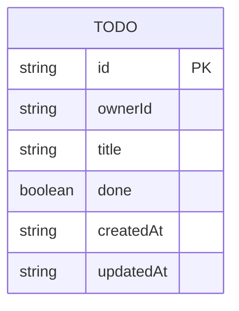

# Domain model

A single entity carries the whole product: a Todo, owned by the signed-in End User who created it.

`ownerId` is the caller's subject from the signed-in session, never a client-supplied value — it is how each End User's todos stay private to them.