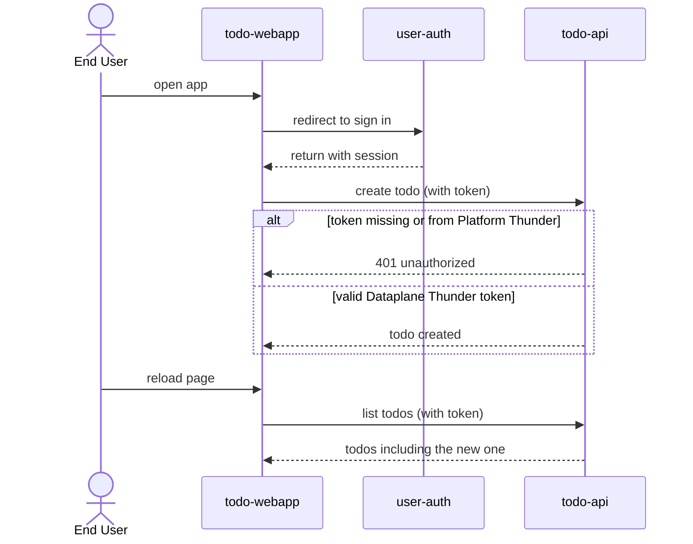

# Sign in and manage todos

An End User signs in through Dataplane Thunder, then adds a todo that persists across a page reload.

```mermaid
sequenceDiagram
    actor EndUser as End User
    participant todo-webapp
    participant user-auth
    participant todo-api

    EndUser->>todo-webapp: open app
    todo-webapp->>user-auth: redirect to sign in
    user-auth-->>todo-webapp: return with session
    todo-webapp->>todo-api: create todo (with token)
    alt token missing or from Platform Thunder
        todo-api-->>todo-webapp: 401 unauthorized
    else valid Dataplane Thunder token
        todo-api-->>todo-webapp: todo created
    end
    EndUser->>todo-webapp: reload page
    todo-webapp->>todo-api: list todos (with token)
    todo-api-->>todo-webapp: todos including the new one
```

